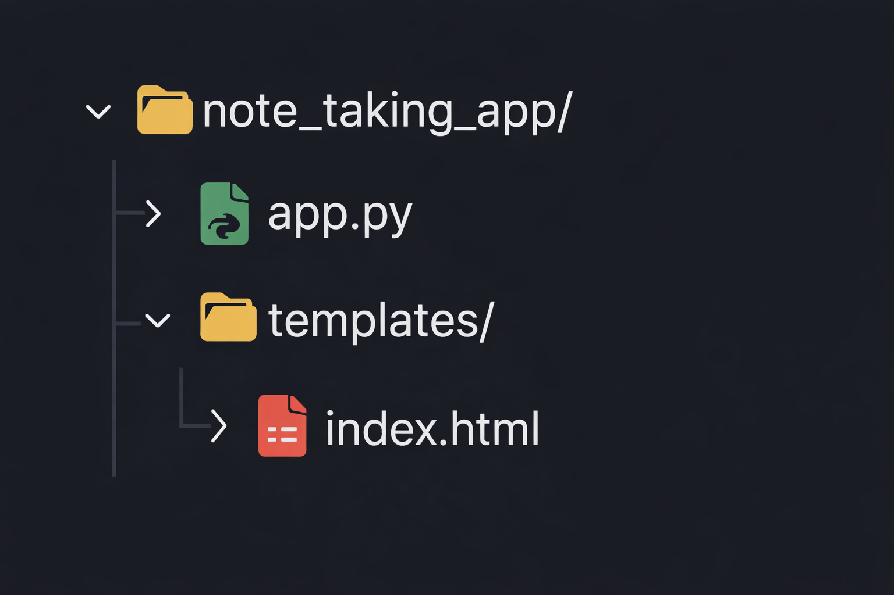

# 📝 Note Taking Web Application (Flask)

A simple Flask-based **Note Taking Web Application** that allows users to add notes using a text field and display them instantly on the same page.

This project was completed as part of a **bug fixing and refactoring assignment** provided by **Innomatics Research Labs**.

---

## 🚀 Project Features

- Single Home Route (`/`)
- Add notes using a text input field
- Display all notes as an unordered list
- Real-time note display on the same page
- Clean and beginner-friendly Flask architecture

---

## 🛠 Tech Stack

- **Backend:** Python, Flask
- **Frontend:** HTML (Jinja2 Templates)
- **Server:** Flask Development Server

---

## 📂 Project Structure




---

## ⚙️ Setup Instructions

### 1️⃣ Clone or Download the Project
```bash
git clone <your-repo-link>
```

or download the ZIP file and extract it.

### 2️⃣ Create Virtual Environment (Optional but Recommended)
```bash
python -m venv venv
venv\Scripts\acti
```

### 3️⃣ Install Dependencies
``` bash
pip install flask
```

### 4️⃣ Run the Application
```bash
python app.py
```
Open your browser and visit:

http://127.0.0.1:5000/

## 🧪 How the Application Works

1. User enters a note in the input field

2. Clicks the Add Note button

3. The note is sent to the backend using a POST request

4. Flask stores the note in memory

5. All notes are displayed below as an unordered list

## 🐞 Bugs Fixed in This Project

- Home route accepted only POST requests

- Incorrect form data retrieval using request.args

- HTML form used GET instead of POST

- Template name mismatch (home.html vs index.html)

- HTML file not placed inside templates folder

- Syntax error in Flask app

- Empty notes being added

All bugs were documented and resolved as part of the assignment.

## 📄 Documentation

A detailed Bug Analysis & Debugging Report (PDF) is included in the submission, explaining:

- Each bug found

- Root cause

- Fix implemented

 ## 🎯 Learning Outcomes

- Flask routing (GET & POST)
- Form handling in Flask
- Template rendering with Jinja2
- Debugging real-world Flask applications
- Clean project structuring

## 🤝 Acknowledgements

Special thanks to Innomatics Research Labs for providing this hands-on debugging assignment that strengthened my Flask fundamentals and backend debugging skills.

## 📌 Author

Kesavapavan Gadde
Flask & Python Enthusiast
